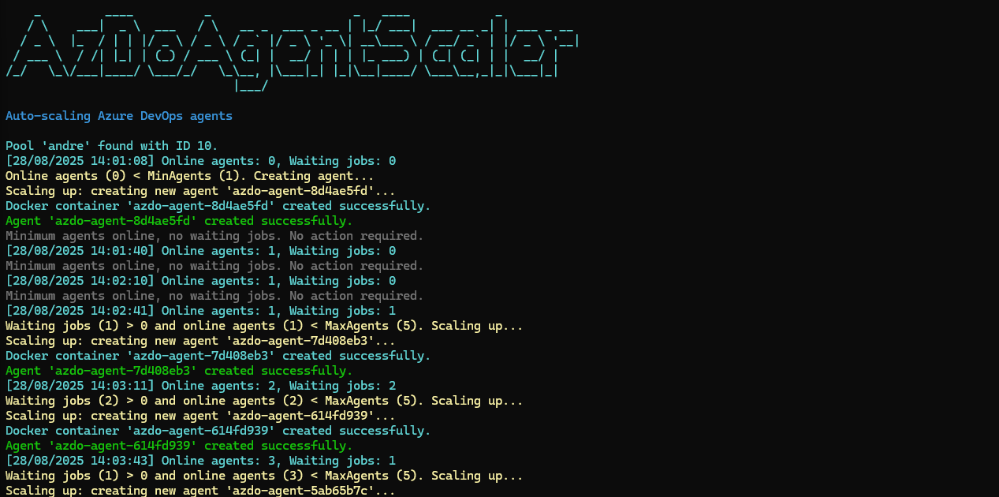

<div align="center">
  
</div>
<br>

**AzDoAgentScaler** is a CLI that enables **dynamic scaling of Azure DevOps self-hosted agents** using **Docker containers**.  
The goal is to optimize resource usage and costs by automatically creating and removing agent instances depending on the build and release workload in Azure DevOps organization.

It continuously monitors the number of **online agents** and **waiting jobs** in a specified agent pool, ensuring that:

- A **minimum number of agents** are always running (`MinAgents`).  
- Additional agents are created when there are **waiting jobs**, up to a **maximum limit** (`MaxAgents`).  
- Idle agents are removed when there are no jobs and the number of agents exceeds the minimum.

This tool only supports **Docker images hosted on Docker Hub**, making it compatible with publicly available agent images or any custom images pushed to Docker Hub.

## Features

- **Automatic scaling** of Azure DevOps self-hosted agents running in Docker containers.  
- Ensures a **minimum number of agents** (`MinAgents`) are always online, regardless of job queue.  
- Automatically **scales up** additional agents when there are **waiting jobs** and the number of agents is below the maximum (`MaxAgents`).  
- **Scales down** idle agents when there are no waiting jobs and the number of agents exceeds the minimum.  
- **Integrates with the Azure DevOps API** to monitor jobs, agent pools, and agent status in real-time.  
- Supports **Docker Hub images only**, allowing the use of official or custom agent images published to Docker Hub.


https://github.com/user-attachments/assets/7e607db5-68cf-4c56-bf10-c6da406930ff


## Requirements

Before running **AzDoAgentScaler**, make sure you have the following:

1. **Docker** installed and **running** on the machine or server where the scaler will execute.  
   - [Install Docker](https://docs.docker.com/get-docker/)

2. **Azure DevOps** configured with **self-hosted agents** and **parallelism enabled** in your plan.  
   - [Azure DevOps Agents Documentation](https://learn.microsoft.com/en-us/azure/devops/pipelines/agents/agents?view=azure-devops)

3. An **Azure DevOps Personal Access Token (PAT)** with at least the following scopes:  
   - `Agent Pools (Read, Manage)`  
   - `Build (Read)`  
   - `Release (Read)` 

## Usage

Once you download the release for your platform, you can run the CLI directly.

### Windows

```powershell
AzDoAgentScaler.exe --org "your-organization" --pat "personal-access-token" --poolName "agent-pool-name"
```

### Linux / MacOS

```bash
./AzDoAgentScaler --org "your-organization" --pat "personal-access-token" --poolName "agent-pool-name"  
```



### CLI Options

| Option          | Required | Description |
|-----------------|----------|-------------|
| `--org`         | ✅ | Azure DevOps organization name |
| `--pat`         | ✅ | Personal Access Token (PAT) with required permissions |
| `--poolName`    | ✅ | Name of the Agent Pool in Azure DevOps |
| `--minAgents`   | ❌ (default: 1) | Minimum number of agents to keep online |
| `--maxAgents`   | ❌ (default: 5) | Maximum number of agents allowed |
| `--interval`    | ❌ (default: 30) | Interval (in seconds) between scaling checks |
| `--dockerImage` | ❌ (default: `mcr.microsoft.com/azure-pipelines/vsts-agent`) | Docker Hub image to use for agent containers |

## How It Works

1. **Monitor agents and jobs**  
   The `AgentScaler` continuously checks:  
   - The number of **online agents** in the specified Azure DevOps agent pool.  
   - The number of **waiting jobs** in the build and release queues.  

2. **Ensure minimum agents**  
   If the number of online agents is less than `MinAgents`, new agents are automatically created, **regardless of waiting jobs**.  

3. **Scale up for workload**  
   If there are waiting jobs and the number of online agents is below `MaxAgents`, new agents are created to handle the workload.  

4. **Scale down idle agents**  
   When there are no waiting jobs and the number of online agents exceeds `MinAgents`, idle agents are removed to save resources.  

5. **No action needed**  
   If online agents equal `MinAgents` and there are no waiting jobs, the scaler takes no action.  


## Contributing & Feedback

Feedback, suggestions, and contributions!  

- If you have ideas for **new features** or **improvements**, please open an [issue](https://github.com/0xAndre/AzDoAgentScaler/issues) and describe your suggestion.  
- Feel free to **submit pull requests** if you want to contribute code or fixes.
